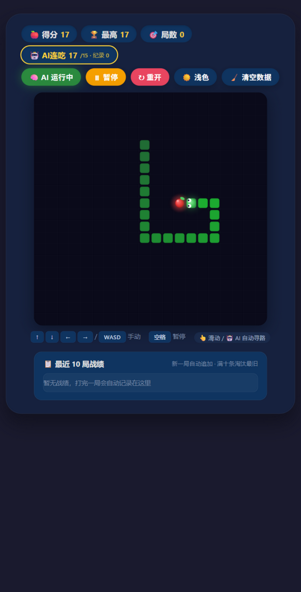
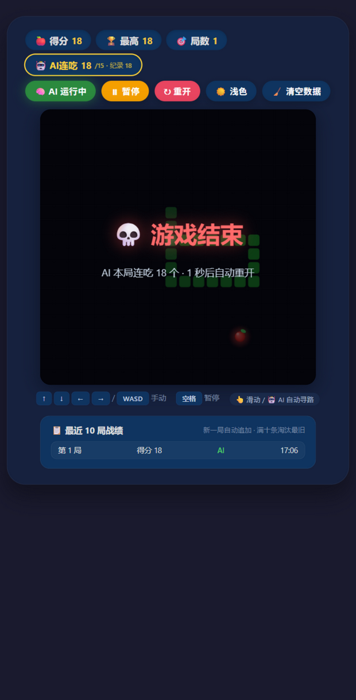
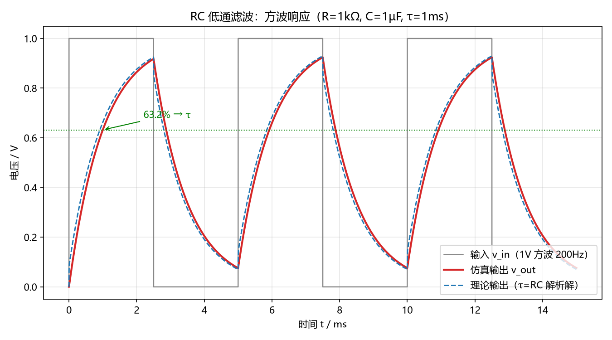
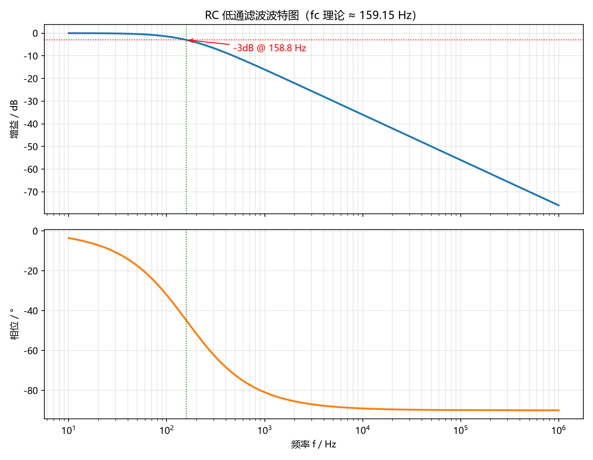
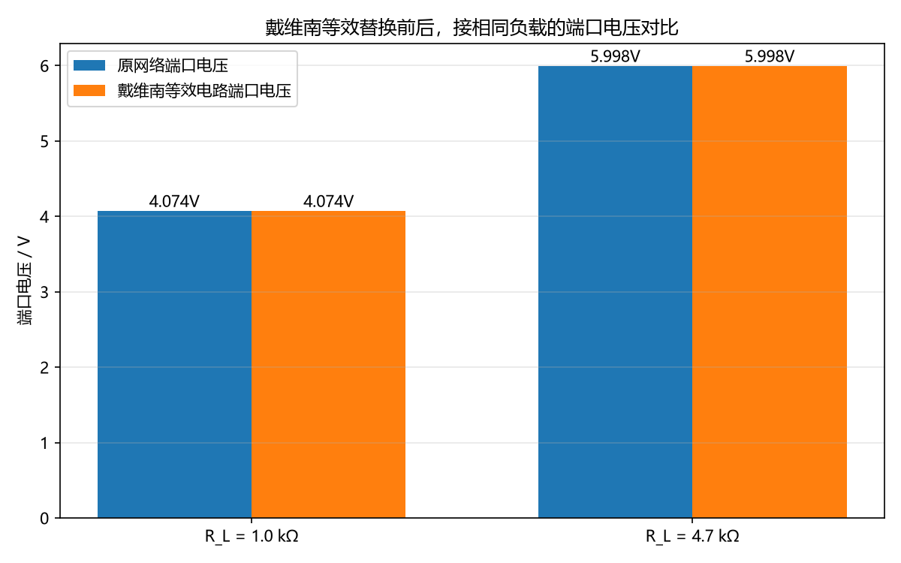
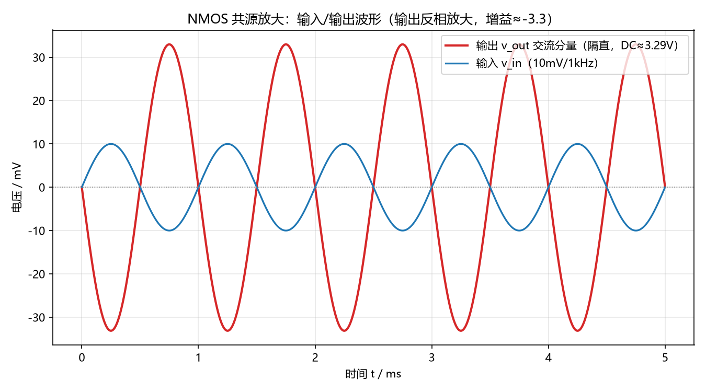
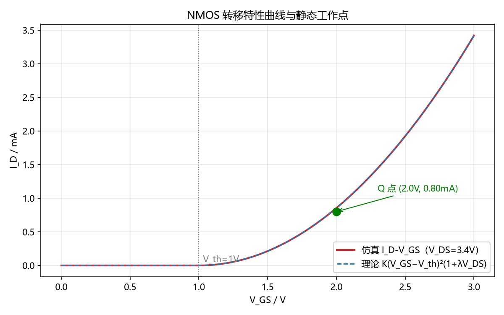

# 大一招新考核作品 · 汤涵轩

微电子科学与工程专业大一。GitHub：[ljz-1209](https://github.com/ljz-1209)，邮箱：3212565632@qq.com。

仓库里有四部分内容：

- 个人主页，已部署 GitHub Pages：https://ljz-1209.github.io/
- [个人简介 PDF](个人简介/汤涵轩-个人简介.pdf)
- [贪吃蛇](games/snake.html)：自己能玩，也带 AI 自动演示
- [PySpice 电路仿真](pyspice/)：RC 低通滤波、戴维南定理验证、NMOS 共源放大

先说清楚 AI 的使用：这个作品是我用 AI 编程助手（ZCode）辅助做的。一般是我把需求想清楚再让 AI 实现，跑通之后自己读代码、测效果，报错就贴回去让它改。电路的手算和查证是我自己做的。哪些是 AI 写的、提示词怎么给的，分别在第二节和 1.5、2.4 里。

## 一、通用素养

**分支和合并**：分支相当于从主线复制出一条能随便改的时间线，改坏了也不影响主线；合并就是把分支上改好的内容汇回主线。这次考核我是直接在 main 上分批提交的（见 COMMIT_PLAN.md），提交记录能看出是一步步做出来的。

**常用命令**：

| 命令 | 用途 |
| --- | --- |
| cd / ls / mkdir | 进入目录 / 列目录内容（Windows 下是 dir）/ 新建文件夹 |
| git init / add / commit | 建仓库 / 暂存修改 / 把暂存内容存成一个版本 |
| git status / log | 看改了什么 / 看提交历史 |
| git push / pull | 推到 GitHub / 拉取远端更新 |

**为什么选 MIT 协议**：它是最宽松的，别人可以随便用、随便改，只要保留版权声明。我写这些本来就希望同学能直接拿去参考，不想加多余的限制。

**两步验证**：已开启。登录时除了密码还要在 GitHub 手机 App 上点批准，或者输验证码。

**一条我查证后发现是错的 AI 信息**：AI 帮我写个人简介时，把我的 GitHub 用户名写成了 liz-1209，和主页上的 ljz-1209 对不上。我访问 `api.github.com/users/liz-1209`，返回 404；换成 ljz-1209 就能查到账号。所以正确的是 ljz-1209，PDF 已经改过来重新生成了。类似的事还有一次：AI 给我的 PySpice 代码里写 `simulator.ac_sweep(...)`，一运行就报 AttributeError，我用 `dir()` 把对象的方法列出来才发现这个版本里方法名是 `simulator.ac(...)`。这两件事让我记住：AI 给的东西，跑一遍才算数。

**两处我能自己讲清楚的代码逻辑**（防"纯粘贴"）：

第一处是贪吃蛇 AI 怎么避开死路。只找最短路径是不够的，因为吃到食物蛇会变长，最短路可能正好把自己堵死。所以 AI 每一步先让一条"虚拟蛇"沿着最短路走完全程（最后一步吃到食物、身体加长一节），然后检查这时候蛇头还能不能追到蛇尾。能追到尾巴，说明身体周围一直有活路，这条路才敢走；不能就放弃吃食物，改成追着自己的尾巴绕，实在不行用洪泛填充数每个方向能到多少空格，挑空间最大的方向走。

第二处是主题保存的坑。切换主题后刷新，颜色总是变回深色。查了才知道 localStorage 里存的都是字符串：我用 JSON.stringify 存进去的值实际带着引号（`"light"` 是 6 个字符），而恢复主题的脚本拿它和 `light`（4 个字符）比较，永远不相等。改成直接存裸字符串就好了。这个 bug 不真正刷新页面根本发现不了。

## 二、贪吃蛇

**怎么打开**：双击 games/snake.html 就能玩，纯前端单文件，没有框架依赖。
**操作**：方向键 / WASD / 手机滑动，空格暂停，点「AI 自动」看 AI 自己玩。

### 阶段一：能自己玩

20×20 棋盘，吃到食物加分变长，撞墙或咬到自己结束。得分、最高分、局数都在顶部，暂停和结束用画布内的提示层，不弹窗。键盘、触屏都做了，并且过滤了 180° 掉头，防止一帧内把自己撞死。以上功能我都手动试过一遍。

### 阶段二：AI 自动演示

AI 的思路就是 1.6 里说的那套：先模拟、确认安全再吃，不安全就保命。相比最早的版本我改了三处：AI 决策从独立定时器挪进了游戏循环（原来 120ms 和 140ms 两个定时器节奏对不上）；死亡后 1 秒自动重开，演示不中断；界面加了「AI连吃 X/15」计数，达标变金色，硬指标达没达成一眼能看出来。

验证结果：三轮实测分别连吃 43、17、18 个，全程没碰键盘，没死过一次。

### 新增功能（要求至少 1 个，我做了 3 个）

- 计分制：最高分和局数存在 localStorage，新开一局不清零；「清空数据」按钮带确认框
- 主题切换：深色浅色两套，画布颜色跟着变，刷新后保留
- 多局战绩：每局结束自动记一条（第几局、得分、AI 还是手动、时间），最多留 10 条

代码来源说明：游戏框架、渲染和 AI 寻路初稿是 AI 写的；节拍合并、自动重开、连吃计数、三个新增功能是我和 AI 来回改出来的；localStorage 那个 bug 是我自己刷出来的，再让 AI 修。

### 提示词记录

1. 「用 HTML/CSS/JS 做贪吃蛇，20×20 棋盘，方向键控制，有得分和结束判定，单文件」——一次成功，这就是阶段一。
2. 「加一个 BFS 寻路 AI，自动吃食物不死」——会吃了，但蛇变长后偶尔把自己困死。
3. 「先让虚拟蛇走完全程，确认吃完还能追到尾巴再走；不行就追尾巴保命」——基本不会死了。
4. 「按验收标准加：最高分/局数持久化+重置按钮、深浅主题+刷新保留、最近 10 局战绩」——功能有了，但实测发现刷新后主题丢，查出是 localStorage 引号问题，改完才真正合格。
5. 「死亡别弹 alert，改成自动重开，界面上显示 AI 连吃计数」——全自动演示跑通，硬指标可以直接看到。

## 三、PySpice 电路仿真

环境：Windows、Python 3.12、PySpice 1.5、ngspice-34 共享库。Windows 下光 pip install 不够，还要跑 `pyspice-post-installation --install-ngspice-dll` 下载 ngspice 的 DLL。每个脚本 `python xxx.py` 直接运行，电路图和波形自动生成在 pyspice/circuits 和 pyspice/plots 里。脚本初稿由 AI 起草，跑通和修错是我做的。

### ① RC 低通滤波（自定参数：R=1kΩ，C=1µF）

手算：τ = RC = 1ms；fc = 1/(2πRC) ≈ 159.15 Hz。

| 指标 | 手算 | 仿真 | 误差 |
| --- | --- | --- | --- |
| τ | 1.000 ms | 1.001 ms | 0.10% |
| fc | 159.15 Hz | 158.78 Hz | 0.23% |

τ 的仿真值取方波上升沿后输出升到 63.2% 的时间，fc 取波特图上增益掉到 -3dB 的位置。方波响应是标准的充放电指数曲线，波特图按 -20dB/十倍频下降，和理论一致。

脚本 [pyspice/rc_lowpass.py](pyspice/rc_lowpass.py)，电路图和完整数据在 pyspice/circuits、pyspice/results 里。

### ② 戴维南定理验证（自定参数：V1=10V，R1=1kΩ，R2=2.2kΩ）

手算：V_oc = 10×2.2/3.2 = 6.875 V；I_sc = V1/R1 = 10 mA；R_th = R1∥R2 = 687.5 Ω。

仿真做了两次 OP：端口开路量 V_oc，端口接一个 0V 源当电流表量 I_sc，得到 6.8750 V 和 10.000 mA，和手算一致，两者相除得 R_th = 687.5 Ω。然后接负载，原网络和等效电路各仿真一次对比：

| R_L | 手算 V | 原网络 V | 等效电路 V |
| --- | --- | --- | --- |
| 1 kΩ | 4.0741 V | 4.0741 V | 4.0741 V |
| 4.7 kΩ | 5.9977 V | 5.9977 V | 5.9977 V |

替换前后完全一样，定理得证。这里踩过一个坑：第一次把等效电压源接在两个悬空节点上，没构成回路，仿真出来全是 0，画了电流路径图才找到问题。

脚本 [pyspice/thevenin.py](pyspice/thevenin.py)。

### ③ NMOS 共源放大（题目固定参数）

先说模型换算：ngspice 的 level-1 模型里 I_D = (KP/2)(W/L)(V_GS−V_th)²(1+λV_DS)，题目给的 K=0.8mA/V² 相当于 KP(W/L)/2，所以模型里取 KP=1.6m、W=L=1µm。

手算：栅极没有静态电流，V_GS = 5×40/(60+40) = 2V。忽略 λ：I_D = 0.8×1² = 0.8mA，V_DS = 5−0.8×2 = 3.4V。把 λ 代进去联立 V_DS = VDD−I_D·Rd 解方程：I_D ≈ 0.853mA，V_DS ≈ 3.295V。两种算法都满足 V_DS > V_GS−V_th，工作在饱和区。

小信号：gm = 2K(V_GS−V_th)，ro = 1/(λI_D)，Av = −gm(Rd∥ro)。

| 指标 | 忽略 λ | 含 λ | 仿真 |
| --- | --- | --- | --- |
| V_GS | 2 V | 2 V | 2.0000 V |
| I_D | 0.800 mA | 0.853 mA | 0.853 mA |
| V_DS | 3.400 V | 3.295 V | 3.2946 V |
| gm | 1.60 mS | 1.705 mS | 1.709 mS |
| Av | −3.20 | −3.298 | −3.305 |

含 λ 的手算和仿真基本重合；忽略 λ 会差 6% 左右，主要是 ro 在分流。输出和输入反相，20mVpp 进去、66mVpp 出来，增益约 −3.3。

脚本 [pyspice/mos_amplifier.py](pyspice/mos_amplifier.py)。

## 四、踩过的坑

1. localStorage 用 JSON.stringify 存的值带引号，主题刷新必丢，改成存裸字符串。
2. AI 死亡后弹 alert 会卡住自动演示，改成画布内提示加自动重开。
3. AI 决策原来用独立 120ms 定时器，和 140ms 的游戏循环不同步，挪进游戏 tick 才对。
4. 游戏结束状态下点「AI 自动」原来只弹提示，改成直接开一局 AI 演示。
5. PySpice 1.5 里没有 ac_sweep，方法名是 ac；VoltageSource 也不认 ac_magnitude 参数，要写原生字符串 'DC 0 AC 1'。
6. schemdraw 存图默认透明背景，在深色界面里看是全黑的，要加 transparent=False。
7. 这台电脑的 Python 没加进 PATH，只能用完整路径调用；git 全局配了代理，代理软件没开时 push 会失败，可以临时用 `git -c http.proxy= -c https.proxy= push` 绕开。
