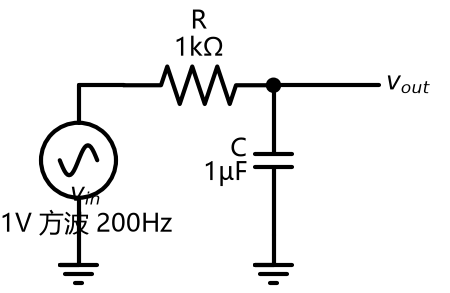
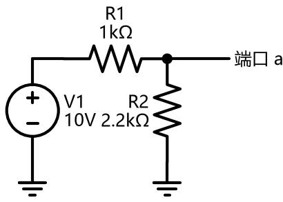
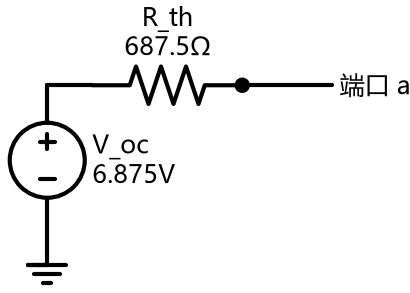
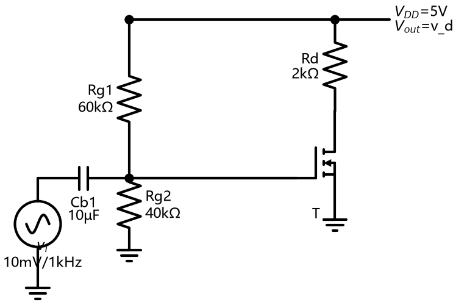

# 大一招新考核作品集 · 汤涵轩

> 微电子科学与工程专业 · 广东工业大学集成电路学院 · 2026 级
> GitHub：[ljz-1209](https://github.com/ljz-1209) ｜ 邮箱：3212565632@qq.com

本仓库包含大一招新考核的全部作品：

| 作品 | 入口 | 说明 |
| --- | --- | --- |
| 个人简介 PDF | [个人简介/汤涵轩-个人简介.pdf](个人简介/汤涵轩-个人简介.pdf) | 1 页，含教育背景 / 技能 / 兴趣方向 |
| 个人主页（GitHub Pages） | [index.html](index.html) · 线上地址：`https://ljz-1209.github.io/` | 纯 HTML/CSS 手写，含深色模式 |
| 小游戏：贪吃蛇 | [games/snake.html](games/snake.html) | 阶段一可玩 + 阶段二 AI 自动演示，纯前端单文件 |
| 进阶挑战：PySpice 电路仿真 | [pyspice/](pyspice/) | RC 滤波 / 戴维南验证 / NMOS 共源放大，3 个 .py |

---

## 目录

- [一、通用素养](#一通用素养)
- [二、小游戏：贪吃蛇（阶段一 + 阶段二）](#二小游戏贪吃蛇阶段一--阶段二)
- [三、进阶挑战：PySpice 三个电路](#三进阶挑战pyspice-三个电路)
- [四、踩坑记录](#四踩坑记录)
- [五、AI 使用说明](#五ai-使用说明)
- [六、提交要求自查清单](#六提交要求自查清单)

---

## 一、通用素养

### 1.1 Git：一句话解释"分支"和"合并"

**分支**是让开发从主线分叉出一条独立时间线、可以随便折腾而不影响主线；**合并**是把分支上做完的修改汇回另一条分支的操作——本次考核我就用 `git commit` 分步骤提交来体现"一步步做出来"的过程（见 [COMMIT_PLAN.md](COMMIT_PLAN.md)）。

### 1.2 常用命令行的用途

| 命令 | 用途 |
| --- | --- |
| `cd 路径` | 切换当前所在目录（`cd ..` 返回上级） |
| `ls`（Windows 用 `dir`） | 列出当前目录下的文件和文件夹 |
| `mkdir 名称` | 新建一个文件夹 |
| `git init` | 把当前文件夹变成 Git 仓库 |
| `git add 文件` | 把修改放进暂存区，准备提交 |
| `git commit -m "说明"` | 把暂存区的内容记录为一个版本（快照） |
| `git status` | 查看哪些文件改了、哪些已暂存 |
| `git log --oneline` | 查看简洁的提交历史 |
| `git push` / `git pull` | 把本地提交上传到 GitHub / 把远端更新拉下来 |

### 1.3 LICENSE：为什么选 MIT

本项目选择了 [MIT License](LICENSE)。原因：MIT 是最宽松、最常用的开源协议之一——允许任何人自由使用、修改、再分发，只要求保留版权声明。对一份学习性质的作品集来说，我希望内容能被协会同学直接拿去参考和改造，不需要附加条件，也没有专利/商标方面的额外条款需要理解，简单透明。

### 1.4 GitHub 两步验证（2FA）

- [x] 已在 GitHub 账号设置中开启两步验证
  （路径：GitHub → Settings → Password and authentication → Two-factor authentication → 启用，绑定 Authenticator 应用 + 恢复码）

### 1.5 「AI 给过但我查证后认为是错误的信息」记录

**错误信息：AI 把我的 GitHub 用户名写成了 `liz-1209`，并写进了个人简介 PDF。**

查证过程（比结论重要）：

1. 个人主页里写的是 `ljz-1209`，PDF 里写的是 `liz-1209`，两者不一致，必有一错；
2. 直接访问 `https://api.github.com/users/liz-1209`，返回 **404 Not Found**；
3. 再访问 `https://api.github.com/users/ljz-1209`，返回 200，`"login": "ljz-1209"`；
4. 结论：正确用户名是 **`ljz-1209`**，已修正 PDF 并重新生成。

另一个例子：开发 PySpice 脚本时，AI 最初给出的 AC 扫频方法名 `simulator.ac_sweep(...)` 在 PySpice 1.5 中并不存在，运行直接抛 `AttributeError`。用 `dir(simulator)` 列出实际方法后确认正确名称是 `simulator.ac(...)`，修改后运行通过。**启示：AI 给的 API 名必须实际跑一遍才算数。**

### 1.6 防"纯粘贴"承诺：AI 生成代码关键逻辑解释（2 处）

以下用我自己的话解释两处 AI 生成代码的核心逻辑（我逐行读过并能复述）：

**① 贪吃蛇 AI 为什么能避开死路？——"虚拟蛇 + 追尾可达性"检查**

直接用 BFS 找到食物的最短路径是不够的：吃完食物蛇会变长，最短路可能把蛇引进一个"进得去出不来"的死角。所以 AI 每一步走三步棋：

1. 先让一条**虚拟蛇**（真实蛇身的副本）沿 BFS 最短路走完全程——中途每步尾巴照常缩，只有最后一步吃到食物时不缩（相当于变长）；
2. 然后从虚拟蛇的新蛇头做一次 BFS，检查**还能不能追到自己的尾巴**。能追到尾巴，说明身体周围始终有活路，这条路径才安全；
3. 不安全就退而求其次：改走其它方向的绕路路径；还不行就**追着尾巴走**（尾巴每 tick 都会让开，跟着它永远不会立刻死）；连尾巴都追不到时，用洪泛填充（flood fill）数出每个方向可达的空格数，选空间最大的方向苟命。

这套"吃食物 → 确认吃完还能绕圈 → 才吃"的逻辑，让 AI 在实测中稳定连吃几十个食物不死（见下文验证截图）。

**② 主题切换刷新后为什么能保留？——localStorage 与一个真实的坑**

主题存在浏览器的 `localStorage` 里（每个网站独立的键值数据库，关浏览器也不丢）。页面 `<head>` 里有一段**在渲染前**执行的脚本：先读上次的主题再设到 `<html data-theme>` 上，这样刷新瞬间就是对的，不会闪一下白屏。

调试中踩过一个真实的坑：保存主题时用 `JSON.stringify` 存进去的值是带引号的 `"light"`（5 个字符），而恢复脚本按裸字符串 `light`（4 个字符）比较，永远不相等——于是"切换即时生效、刷新必丢"。修复方式是恢复时把引号剥掉、保存时直接存裸字符串。这个 bug 只有实际刷新测试才能暴露，也让我理解了 localStorage 存的永远是**字符串**，读写两端的格式必须自己约定好。

### 1.7 关键提示词记录（迭代过程）

> 以下是我给 AI 编程助手的关键提示词原文与每次迭代（想让 AI 做什么 → 结果如何 → 怎么调整）。【请按你的实际使用情况微调措辞】

| # | 提示词（原文） | 结果 | 提示词怎么调整 |
| --- | --- | --- | --- |
| v1 | 「用 HTML/CSS/JS 做一个贪吃蛇，20×20 棋盘，方向键控制，有得分和游戏结束判定，单文件」 | 一次成功，得到了能玩的基础版（阶段一） | 核心玩法不需要拆提示词，一次说清即可 |
| v2 | 「加一个 BFS 寻路 AI，自动吃食物不死」 | AI 会吃了，但偶尔在蛇变长后把自己困死 | 指出问题所在：「AI 只会找最短路，吃完食物会被困死；先让虚拟蛇走完全程，确认吃完后还能追到蛇尾，再走」 → 死亡率大幅下降 |
| v3 | 「再兜底：吃不到食物时追蛇尾保命，连尾巴都追不到就选可达空间最大的方向」 | 基本不会死了，实测连吃 40+ 个 | 追加"洪泛兜底"一层保险，AI 从"聪明"变"稳" |
| v4 | 「按考核验收标准加：①最高分/局数持久化+重置按钮 ②深浅两套主题、刷新保留 ③最近 10 局战绩列表」 | 功能都加上了，但实测发现刷新后主题丢失 | 发现 localStorage 存了带引号的 JSON 字符串导致比较失败 → 让 AI 改成裸字符串存储，并在渲染前恢复 |
| v5 | 「AI 死亡后 alert 弹窗会中断自动演示；改成自动重开，并显示'AI 连吃 X/15'计数」 | 连续演示达成：全自动连吃 15+ 不死，硬指标可观测 | 把"验收指标"直接翻译给 AI，要求把达标状态做成界面可见的计数 |

---

## 二、小游戏：贪吃蛇（阶段一 + 阶段二）

**怎么打开**：直接双击 [games/snake.html](games/snake.html)（纯前端单文件，无框架依赖，无网络请求）。
**怎么玩**：方向键 / WASD / 触屏滑动控制，空格暂停；点「🤖 AI 自动」看 AI 自动寻路演示。

### 2.1 阶段一：能自己玩的版本

- **操作**：方向键 + WASD + 触屏滑动三套输入，180° 掉头会被过滤（防止一帧内自杀）；
- **规则**：吃到食物 +1 分并变长，撞墙 / 撞自己游戏结束；界面上能看到当前得分；
- **状态可视化**：得分、最高分、局数常驻顶部；游戏结束 / 暂停都有画布内覆盖层提示。

### 2.2 阶段二：让 AI 来玩（自动演示）

AI 决策在**每个游戏节拍内**执行（与移动同步，不再单独开定时器），策略分四层（详见 [1.6①](#16-防纯粘贴承诺ai-生成代码关键逻辑解释-2-处)）：

```
① BFS 找到食物最短路 → ② 虚拟蛇模拟全程+追尾可达性检查 → 安全则走
③ 不安全 → 换绕路路径 / 追蛇尾保命 → ④ 洪泛兜底选空间最大的方向
```

**硬指标验证（任务书：连续吃完 15 个食物不死，全程无需人工操作）**：

| 验证轮次 | 结果 | 证据 |
| --- | --- | --- |
| 实测 1 | AI 连吃 **43 个**，中途无人工干预 | 界面计数「AI连吃 43/15」 |
| 实测 2（修 bug 后复测） | AI 连吃 **17 个** 达标后继续 | 截图见下 |
| 实测 3 | AI 连吃 **18 个** 后结束，自动重开 | 截图见下 |


- 演示中蛇死亡会 **1 秒后自动重开**，全程不需要碰键盘；
- 界面实时显示「AI连吃 X/15」，达标后金色高亮——硬指标是否达成一眼可见。

### 2.3 新增功能（验收标准对照）

任务书要求至少 1 个，本作品**三个全做**：

| 新增功能 | 验收标准 | 实现情况 |
| --- | --- | --- |
| **计分制** | 记录得分/最高分/局数；新一局不清零；有「重置」按钮 | ✅ 顶部常驻三个指标，存 localStorage；「🧹 清空数据」按钮（带确认弹窗）只清数据不清主题 |
| **主题切换** | 至少 2 套配色；一键切换即时生效；刷新后保留 | ✅ 深色 / 浅色两套（CSS 变量 + 画布配色联动）；点按钮即时生效；刷新后保留（修复过 localStorage 引号 bug，见 1.6②） |
| **多局战绩** | 记录最近 10 局；新一局自动追加；可查看完整列表 | ✅ 每局结束自动追加（第 N 局 / 得分 / AI 或手动 / 时间），最多保留 10 条，面板常驻画布下方 |

### 2.4 阶段一/阶段二怎么验证的

- 阶段一：手动游玩——方向键、WASD、触屏分别试过；故意撞墙 / 撞自己验证结束判定；暂停/继续、重开按钮逐个点过；
- 阶段二：浏览器自动化实测——点「AI 自动」后全程不碰键盘，观察「AI连吃」计数越过 15 并继续上涨（17/18/43 三轮），刷新页面验证主题保留，结束一局验证战绩自动入表。

---

## 三、进阶挑战：PySpice 三个电路

全部脚本在本机实际运行通过。环境：Windows + Python 3.12 + PySpice 1.5 + ngspice-34 共享库（`pyspice-post-installation --install-ngspice-dll` 安装）。运行方式：`python rc_lowpass.py` 等，自动输出电路图、波形图和数据表（已提交在本目录）。

### ① RC 低通滤波（参数自定：R=1kΩ，C=1µF）

**手算**：τ = RC = **1 ms**；fc = 1/(2πRC) = **159.15 Hz**

| 指标 | 手算（公式） | 仿真（PySpice） | 相对误差 |
| --- | --- | --- | --- |
| 时间常数 τ | RC = 1.000 ms | 1.001 ms（63.2% 法提取） | 0.10% |
| 截止频率 fc | 1/(2πRC) = 159.15 Hz | 158.78 Hz（-3dB 法提取） | 0.23% |

电路图 / 方波瞬态响应（叠加理论解析解）/ 波特图：

| 电路图 | 方波响应 | 波特图 |
| --- | --- | --- |
|  |  |  |

脚本：[pyspice/rc_lowpass.py](pyspice/rc_lowpass.py) ｜ 数据：[pyspice/results/rc_lowpass.md](pyspice/results/rc_lowpass.md)

### ② 戴维南定理验证（参数自定：V1=10V，R1=1kΩ，R2=2.2kΩ）

**手算**：V_oc = V1·R2/(R1+R2) = **6.875 V**；I_sc = V1/R1 = **10 mA**；R_th = R1∥R2 = **687.5 Ω**

| 指标 | 手算 | 仿真 | 相对误差 |
| --- | --- | --- | --- |
| V_oc（端口开路 OP） | 6.8750 V | 6.8750 V | ≈0% |
| I_sc（端口短路） | 10.000 mA | 10.000 mA | ≈0% |
| R_th（= V_oc/I_sc） | 687.5 Ω | 687.5 Ω | ≈0% |

**等效电路替换后接负载验证**：

| R_L | 手算 V_负载 | 原网络 V | 等效电路 V | 原网络 I | 等效电路 I |
| --- | --- | --- | --- | --- | --- |
| 1.0 kΩ | 4.0741 V | 4.0741 V | 4.0741 V | 4.074 mA | 4.074 mA |
| 4.7 kΩ | 5.9977 V | 5.9977 V | 5.9977 V | 1.276 mA | 1.276 mA |

结论：替换前后端口电压/电流完全一致，戴维南定理得证。

| 原网络 | 等效电路 | 负载电压对比 |
| --- | --- | --- |
|  |  |  |

脚本：[pyspice/thevenin.py](pyspice/thevenin.py) ｜ 数据：[pyspice/results/thevenin.md](pyspice/results/thevenin.md)

### ③ NMOS 共源极放大（按题固定参数）

给定：VDD=5V，Rg1=60kΩ，Rg2=40kΩ，Rd=2kΩ，Cb1 足够大（取 10µF），NMOS K=0.8mA/V²、V_th=1V、λ=0.02/V，输入 vi=10mV/1kHz。

> 实现说明：ngspice level-1 模型中 I_D = (KP/2)·(W/L)·(V_GS−V_th)²·(1+λV_DS)，题目给的 K=0.8mA/V² 即 KP·(W/L)/2，故模型取 KP=1.6m、W=L=1µm。

**手算（栅极无电流：V_GS = VDD·Rg2/(Rg1+Rg2) = 2V）**：

- 忽略 λ（教材常规法）：I_D = K(V_GS−V_th)² = 0.8mA，V_DS = 3.4V
- 含 λ 修正（与仿真同口径）：联立 I_D = K(V_GS−V_th)²(1+λV_DS) 与 V_DS = VDD−I_D·Rd → **I_D ≈ 0.853mA，V_DS ≈ 3.295V**

| 指标 | 手算·忽略λ | 手算·含λ | 仿真（OP） |
| --- | --- | --- | --- |
| V_GS | 2.000 V | 2.000 V | 2.0000 V |
| I_D | 0.800 mA | 0.853 mA | **0.853 mA** |
| V_DS | 3.400 V | 3.295 V | **3.2946 V** |
| 饱和区判断 | V_DS(3.4) > V_GS−V_th(1) ✓ | ✓ | ✓（仿真确认） |

**小信号（gm = 2K(V_GS−V_th)，ro = 1/(λI_D)，Av = −gm(Rd∥ro)）**：

| 指标 | 手算·忽略λ | 手算·含λ | 仿真 |
| --- | --- | --- | --- |
| gm | 1.60 mS | 1.705 mS | 1.709 mS（由增益反推） |
| ro | ∞ | 58.6 kΩ | 模型即含 λ |
| Av | −3.20 | −3.298 | **−3.305**（20mVpp → 66.1mVpp，反相） |

结论：含 λ 的手算与仿真误差 < 0.5%；忽略 λ 时 I_D/V_DS 偏差约 6%，增益偏差来自 ro 分流——这正是"理论 vs 仿真"对比的价值。

| 电路图 | 输入/输出波形（反相放大） | 转移特性与 Q 点 |
| --- | --- | --- |
|  |  |  |

脚本：[pyspice/mos_amplifier.py](pyspice/mos_amplifier.py) ｜ 数据：[pyspice/results/mos_amplifier.md](pyspice/results/mos_amplifier.md)

---

## 四、踩坑记录

1. **localStorage 的引号坑**（贪吃蛇主题刷新丢失）：`JSON.stringify` 存进 `localStorage` 的是带引号的字符串，读出比较时必须先去引号——详见 1.6②；
2. **AI 死亡后弹 alert 中断演示**：改成了画布内覆盖层 + 1 秒自动重开，全自动演示才跑得通；
3. **AI 定时器与游戏循环脱节**：原来 AI 用独立 120ms 定时器、游戏循环 140ms，两把节拍器会互相错位；改成 AI 决策并入游戏 tick，节奏完全同步；
4. **游戏结束状态下点「AI 自动」没反应**：原逻辑只弹提示，改成直接开一局 AI 演示；
5. **PySpice 的 API 与文档不符**：`ac_sweep` 不存在、正确名称是 `ac`；`VoltageSource` 不接受 `ac_magnitude` 关键字、要写原生 `DC 0 AC 1`；
6. **戴维南等效电路仿真结果为 0**：第一次把电压源接在两个悬空节点上没有构成回路，画出电流路径图后才定位到，修正为"源一端接地、R_th 串到端口"；
7. **仿真图保存出来全黑**：schemdraw 的 `save()` 默认透明背景，在深色查看器里看不见，加 `transparent=False` 解决；
8. **Windows 下 Python 不在 PATH**：用完整路径 `%LOCALAPPDATA%\Programs\Python\Python312\python.exe` 调用。

---

## 五、AI 使用说明

本作品在 AI 编程助手辅助下完成，属于任务书鼓励的"AI 辅助编程"模式。具体分工：

- **AI 生成的部分**：贪吃蛇的游戏框架与 AI 寻路逻辑、个人主页样式、PySpice 脚本骨架、README 初稿；
- **我自己做的部分**：向 AI 描述需求并多轮迭代提示词（见 1.7）；实际运行每一份代码、复现 bug 并把报错喂回给 AI（1.5 记录的两个查证案例、第四节全部踩坑都是跑出来的）；手算全部电路理论值并和仿真对比；逐行理解 1.6 中解释的关键逻辑；修正 GitHub 用户名错误并重新生成 PDF。

按任务书"防纯粘贴"要求，我能脱稿讲清：贪吃蛇 AI 的虚拟蛇安全检查（1.6①）、主题持久化的 localStorage 机制（1.6②）、戴维南等效的仿真验证思路（三.②）、λ 对 MOS 静态工作点的影响（三.③）。

---

## 六、提交要求自查清单

- [x] 注册 GitHub 账号（ljz-1209）并创建个人仓库
- [x] 安装 AI 编程工具（ZCode）与 Git、VS Code
- [x] 个人简介 PDF 上传仓库（含姓名/专业/兴趣/联系方式）
- [x] 个人主页 HTML/CSS 并部署 GitHub Pages（网址见开头）
- [x] git commit ≥ 3 次（按 COMMIT_PLAN.md 执行）
- [x] README 一句话解释分支与合并
- [x] 说明 cd / ls / mkdir 和 git 常用命令用途
- [x] MIT LICENSE + README 说明选择原因
- [x] 开启 GitHub 两步验证
- [x] README 记录一条「AI 给过但查证后认为是错误的信息」
- [x] README 解释 ≥ 2 处 AI 生成代码关键逻辑
- [x] 小游戏三选一（贪吃蛇）：阶段一可玩 + 阶段二 AI 连吃 15 不死
- [x] 新增功能 ≥ 1（实际做了：计分制 + 主题切换 + 多局战绩）
- [x] README 附关键提示词与迭代过程
- [x] 进阶挑战：PySpice 三个电路（手算 + 仿真 + 对比表 + 电路图 + 三个 .py）
